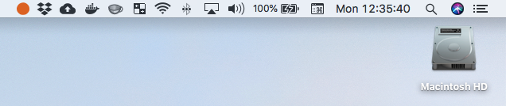

# Headspace

Are you using [Headspace](https://www.headspace.com) to meditate? You'll sooner or later hear the tip to put small stickers at places in your home or at work. These stickers are meant to remind you to briefly pause, breathe in and be present.

If you spend quite some time behind your mac and don't want to put a sticker on it, use this app. It simply adds the Headspace icon in your macOS status bar:

This app doesn't do a lot more than that. You can enable black/white mode, start the app at login and that's about it. It's simply meant as a little reminder, nothing more.

## Installation

1. [Download the app](https://raw.githubusercontent.com/jasperkuperus/Headspace/master/Release/Headspace.app.zip)
2. Put the app in `~/Applications`

The first time you'll open the app you will probably get a warning about me being an [unidentified developer](https://support.apple.com/kb/ph25088?locale=en_US). Just Right click (or Ctrl + click) the app icon and select Open.
